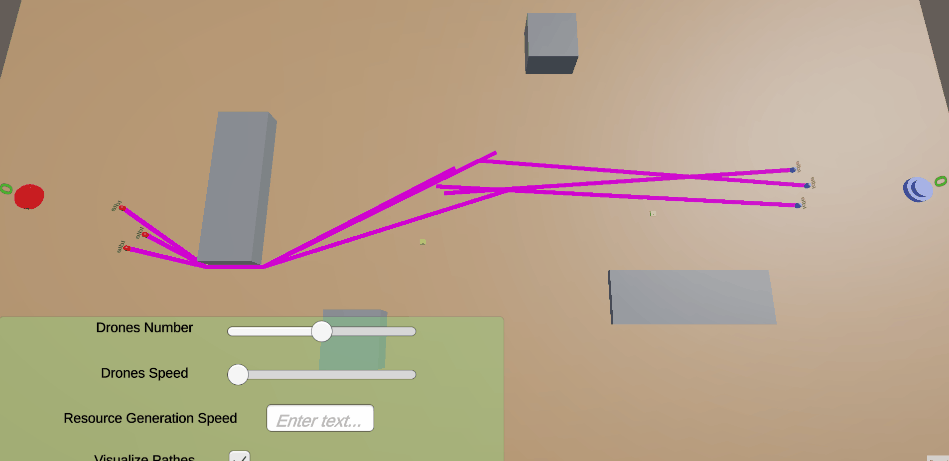

# Drone_sim
Тестовое задание: Симуляция сбора ресурсов дронами фракций.

## Описание реализации
Две базы, каждая выбирает фракцию в зависимости от настроек и заказывает себе дронов в количестве, соответстующему состоянию слайдер и своей фракции.
После создания боты начинают патрулировать местность в посиках ресурсов, статус дрона отражается в тексте над ним. После обнаружения ресурса приближаются к нему, собирают и относят на базу. Проигрывается эффект, счетчик увеличивается.
Количество дронов, их скорость, скорость генерации ресурсов, отображение текущих маршритов можно изменять с помощью интерфейса, в соответствии с заданием.
Задачи основного списка реализованы все.
Жесткие ссылки только на гарфические элементы или внутрь собственной иерархии префаба
Используется Singleton, частично Factory и MVVM.
Гейплейные элементы создаются динамически.
## Реализованые опциональные задачи
- Дроны красятся в цвет своей фракции
- Текущий статус дрона отображается интерфейсом
